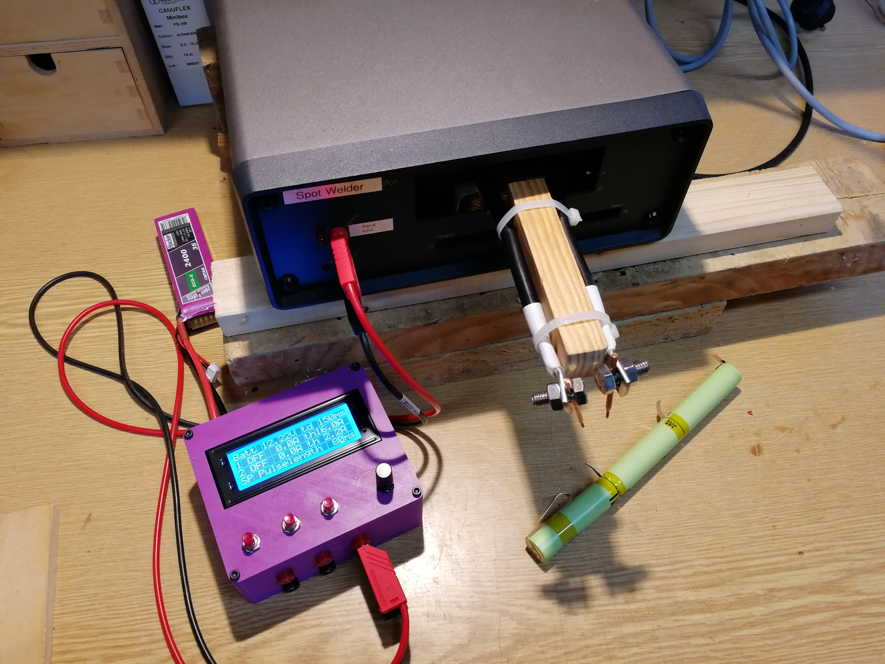

# EFuse Spotwelder
Modified code for the Arduino EFuse using Infineon BTS7002 High-Side-Switches to control a spot-welding transformer with the 3rd channel.

* Original EFuse project and instructions can be found here: https://www.hackster.io/Infineon_Team/electronic-fuse-with-bts7002-1epp-a57d3a
* Instruction how to build the spot welder here: https://www.instructables.com/Building-a-Spot-Welding-Machine-From-a-Microwave-O/

Instead of the China-controller baord, the EFuse together with a relay can be used.

The code offers the following functionality:
* Monitoring the current on channels 1 and 2
* Change threshold current, when the High-Side Switches should turn off
* Change timedelay, how fast Ch1 or Ch2 will switch off if an overcurrent event was detected
* **NEW**: Ch3 outputs a user-definable pulse-pattern

This pulse pattern is used to control a relay (I'm using a 25A Solid-State Relais), which switches the primary winding of a modified microwave oven transformer. It first creates a 50ms pulse to heat up the metal, then 50ms pause followed by an adjustable pulse (10 - 990ms). I estimated 80ms as a good value. 